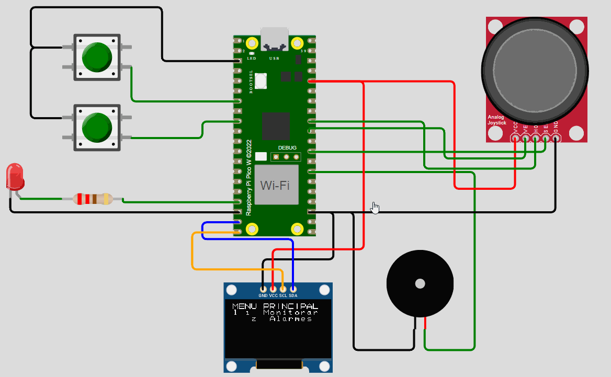

# ✨ Tarefa Final-HealthWatch-er: Sistema de Monitoramento de Saúde com Alarme SOS e Temporizador de Medicação

 Repositório dedicado a Tarefa Final do processo de capacitação do EmbarcaTech que envolve a implementação de um sistema embarcado de monitoramento de saúde na placa Raspberry Pi Pico W por meio da Plataforma BitDogLab.

## :clipboard: Apresentação da tarefa

O projeto propõe o desenvolvimento de um sistema embarcado para monitoramento da saúde em tempo real. Ele integra um sensor de batimentos cardíacos, um giroscópio, um alarme configurável para administração de medicamentos e um botão de emergência. Destinado a idosos e pacientes que necessitam de acompanhamento contínuo, o sistema emite alertas visuais e sonoros em situações críticas. O projeto foi feito na plataforma BitDogLab, que possui a placa Raspberry Pi Pico W e componentes eletrônicos que possibilitam a simulação do sistema embarcado citado.

## :dart: Objetivos

- Fomentar um sistema embarcado de baixo custo, alta customização, com potencial wearable e confiável para fins médicos;
- Monitorar batimentos cardíacos (BPM) e detectar quedas por meio de um giroscópio, ambos sendo simulados por um Joystick(ADC), fornecendo avisos sonoros e visuais para o cuidador;
- Implementar um algoritmo de média móvel com histerese para melhor controle do fluxo de dados vindo por parte do sensor cardíaco;
- Oferecer um alarme temporizador configurável para lembretes de medicamentos ou atividades, auxiliando a recuperação do paciente;
- Adicionar um botão SOS para emergências do paciente, reforçando a segurança do usuário;
- Implementar uma IHM (Interface Humano-Máquina) para controle e monitoramento de funções e sensores.

## :walking: Integrantes do Projeto

- Matheus Pereira Alves

## :bookmark_tabs: Funcionamento do Projeto

- Coleta e Processamento de Dados: O firmware realiza a leitura dos sinais provenientes de dois canais ADC (ADC0 e ADC1), um canal representa os batimentos cardíacos (BPM) do usuário, enquanto o outro indica um giroscópio
e seu eixo Z. Ambos os sensores são simulados por meio de um Joystick soldado a placa BitDogLab.

- Interface Humano-Máquina via Display OLED: Através do display OLED e o protocolo de comunicação I2C, o sistema possui um menu interativo que possibilita duas funções principais: monitorar e alarmes. A primeira é responsável pelo acompanhamento do estado do usuário, sua frequência cardíaca e se esse sofreu uma queda ou não. O segundo, por sua vez, é responsável por configurar um alarme que vai de 1 minuto a 8 horas, com intuito de administração de medicamentos ou realização de atividades físicas.

- Controle e Navegação pelo Menu: Dois botões físicos, juntamente com a funcionalidade do joystick, permitem a navegação pelo menu do sistema. Essa interface possibilita a seleção entre as opções de monitoramento e de configuração dos alarmes, além de permitir o acionamento de funções específicas, como a confirmação ou o cancelamento de alertas.

- Gerenciamento de Alertas: O firmware inclui uma rotina de verificação dos parâmetros lidos (BPM e valores do acelerômetro) para identificar condições críticas. Esses parâmetros passam por rotinas de média móvel, que previnem a entrada em estado de alerta em valores imediatos, sendo utilizado a média de uma certa quantidade de amostras do valor ADC. Caso os valores estejam fora dos limites estabelecidos, o sistema dispara um alerta, que permanece ativo até a intervenção do usuário, permitindo uma resposta rápida em situações emergenciais.

- Utilização de Interrupções, PWM e Timers: A utilização de interrupções garante uma resposta rápida aos eventos, como a pressão dos botões e do joystick, enquanto a modulação por largura de pulso (PWM) é empregada para o controle do buzzer, possibilitando a emissão de sons de alarme com intensidade configurável. Os timers tomam parte central quando se trata da parte de debounce dos botões e joystick, como também para contabilização de eventos, como o alarme configurável via IHM.

## :speech_balloon:Justificativa do Projeto

Em 2022, a população idosa no Brasil correspondia a 10,9% do total, evidenciando um aumento de quase 60% ao longo de uma década. Entre os principais desafios enfrentados por esse grupo, especialmente entre aqueles com mobilidade reduzida, destacam-se as doenças cardíacas e os acidentes domésticos, como as quedas. Refletindo sobre esse paradigma, surge a ideia de criar um sistema embarcado de baixo custo, customizável e possivelmente wearable, complementando o cuidado necessário com essa fração crescente da população. A integração de tecnologias embarcadas e wearables representa uma tendência global na área de saúde, permitindo monitoramento contínuo e prevenção de problemas de forma proativa.

## :wrench:Especificação de Hardware
###   Diagrama em blocos do Hardware do sistema embarcado proposto

### Circuito Esquemático do sistema embarcado proposto

## :information_source:Especificação de Firmware
###   Diagrama de blocos do firmware do sistema embarcado

### Fluxograma do código implementado na placa Raspberry Pi Pico W

## :pencil:Metodologia do Projeto
Para a execução do projeto, adotou-se uma abordagem estruturada que abrangeu as seguintes etapas:
- Pesquisa e Levantamento de Projetos Correlatos: Inicialmente, foi realizada uma investigação de soluções similares voltadas ao monitoramento de saúde e sistema de alarme sobre o estado do usuário, o que auxiliou na definição dos requisitos e na escolha dos componentes adequados;
- Escolha e Definição do Hardware: Foi utilizada a placa Raspberry Pi Pico W e foram definidos os componentes complementares – display OLED I2C, buzzer, LED, joystick (ADC) e botões – de modo a compor um sistema funcional e de fácil implementação;
- Definição das Funcionalidades do Firmware: Foram estabelecidas as funcionalidades essenciais do sistema, como a leitura e conversão dos sinais dos sensores, a navegação interativa pelo menu via display OLED, e a implementação dos mecanismos de alerta (alarmes, alertas por sensores e acionamento SOS).

## :bar_chart:Teste de Validação e Resultados do Projeto
Os testes de validação ocorrem por meio do simulado Wokwi integrado por meio de uma extensão ao editor de texto VScode, que após os devidos testes, foram implementados na placa BitDogLab por meio da conexão USB.
Os resultados foram satisfatórios com base nos objetivos propostos no início do projeto, em qual o sistema opera de forma assíncrona entre os submenus, os valores dos sensores entram em modo de alerta em valores críticos, os indicadores visuais e sonoros funcionam adequadamente e a IHM é simples e intuitiva.

## 🧮 Simulação do Projeto

- É necessário ter o VScode instalado
- É necessário ter o C/C++ e CMAKE instalados como extensão VScode
- É necessário ter o Wokwi Simulator instalado como extensão do VScode e uma chave ativa
- É necessário compilar o arquivo.c por meio da extensão oficial do Raspberry Pi Pico
- Utilize o arquivo diagram.json para rodar a simulação

## :camera: GIF mostrando o funcionamento do programa por meio do simulador integrado Wokwi

  

## :camera: GIF mostrando o funcionamento do programa na placa BitDogLab

  

## :arrow_forward: Vídeo no youtube mostrando o funcionamento do programa na placa BitDogLab

    <a href="https://www.youtube.com/watch?v=_1m_wLxO5N8">Clique aqui para acessar o vídeo</a>

